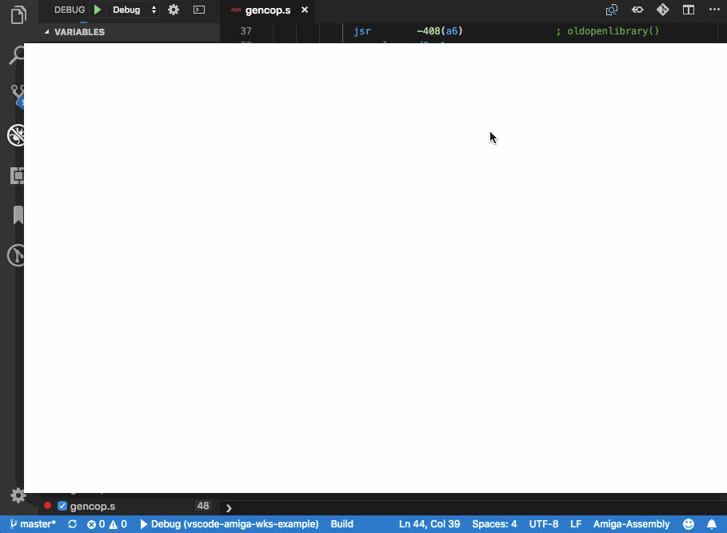
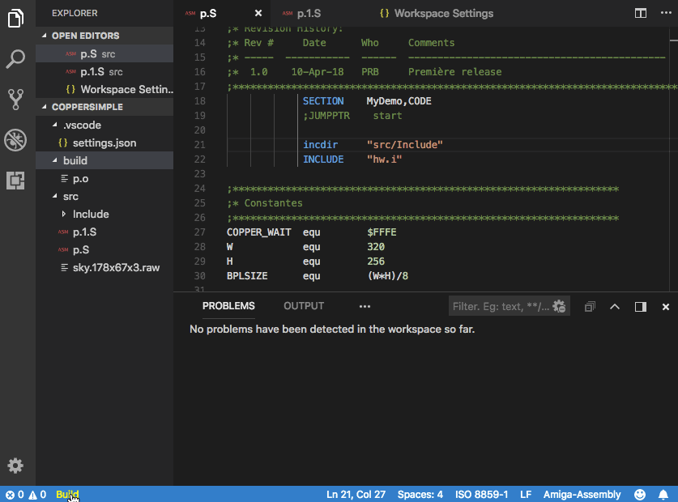
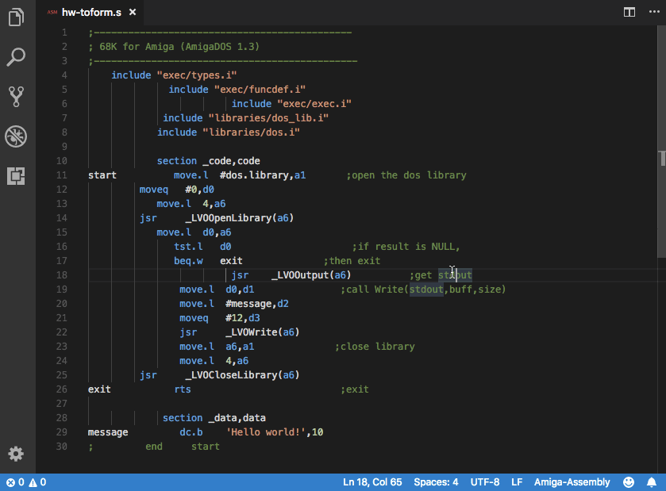
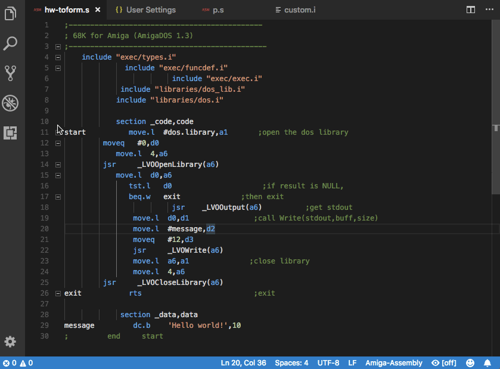
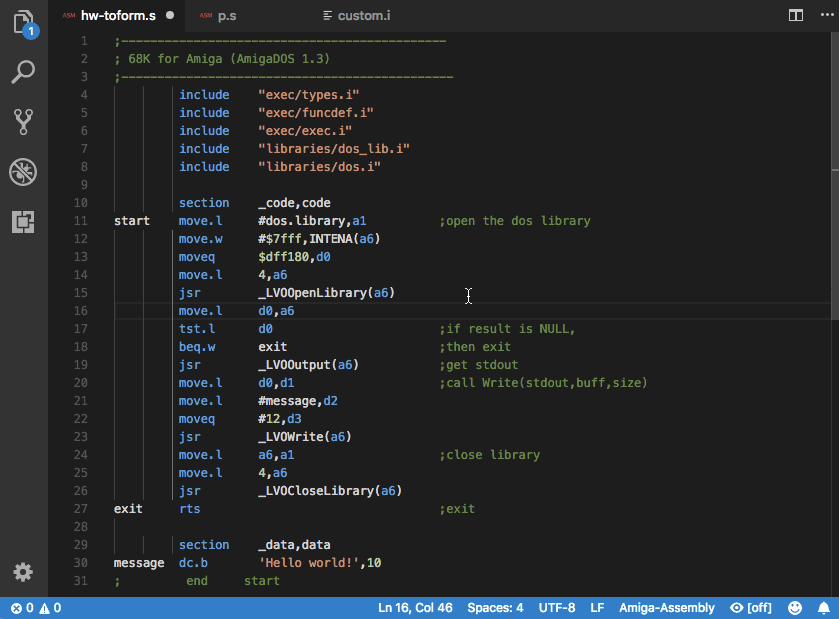
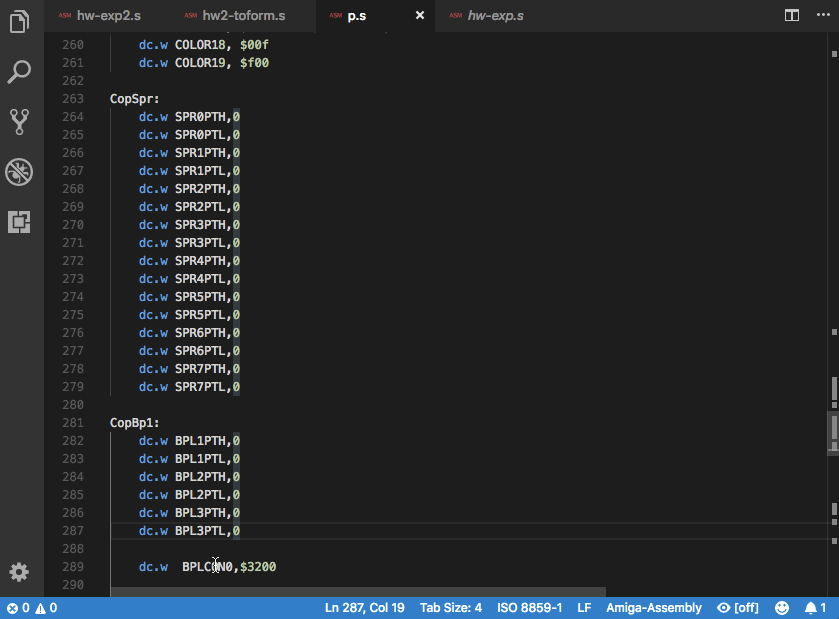
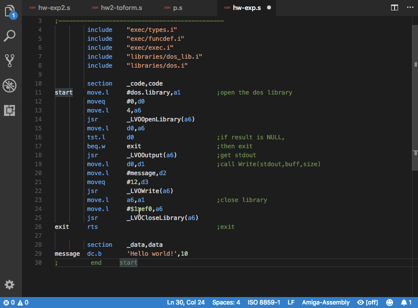
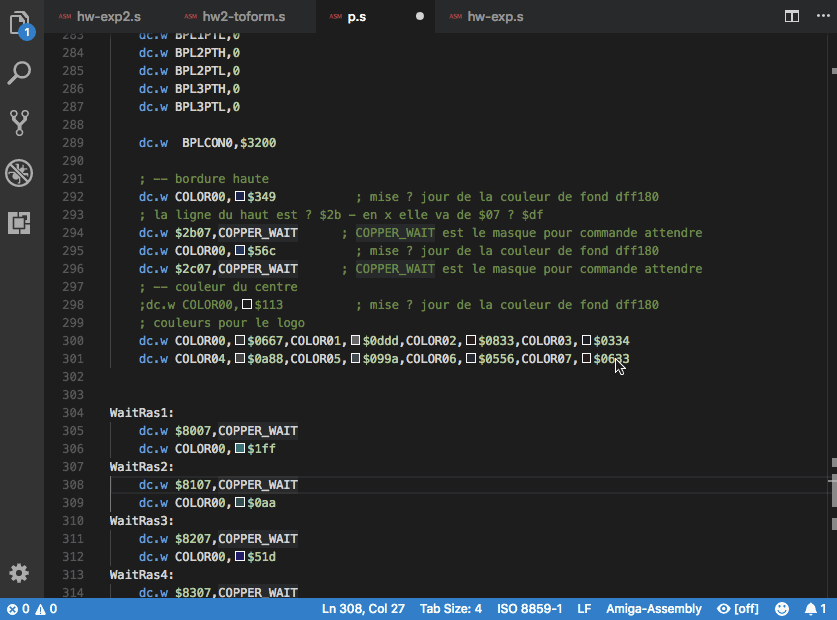
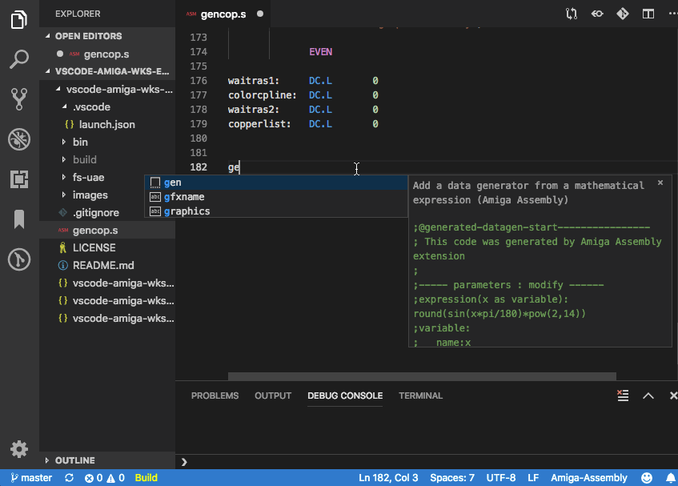

# Amiga Assembly for Visual Studio Code
Amiga Assembly for Visual Studio Code is a extension to support assembly language for the Amiga Motorola 68000 machines and emulators.

Visit the [WIKI](https://github.com/prb28/vscode-amiga-assembly/wiki) pages to discover all the features and get the documentation.

**For an easy startup try the** [getting started example](https://github.com/prb28/vscode-amiga-assembly/wiki/Getting-started).

### Run and Debug with FS-UAE or WinUAE

## New in 1.1 - pre-release
- Memory read/write/readwrite watch breakpoint on WinUAE [wiki details](https://github.com/prb28/vscode-amiga-assembly/wiki/Debugging-emulator#add-a-memory-watch-breakpoint-on-winuae)
- Completion, outline, documentation improvements by *grahambates*
- Add documentation for compiler directives
- Extension compressed with webpack (faster loading time)
- Bug fixes

## Breaking change 1.0!

The build system has been reviewed :
- 3 commands have been replaced by tasks:
    - `amigaassembly: build`: to build the workspace
    - `amigaassembly: build current file`: to build the current file as an executable
    - `amigaassembly: compile current file`: to compile the current file (creates a .o file)
    - `amigaassembly: create ADF`: to create an ADF file
- Builds are triggered in a terminal to show the output
- There is no more the "Build" button in the bottom of the window
- The *launch.json* parameter `"buildWorkspace": true,` is replaced by `"preLaunchTask": "amigaassembly: build"`

### Other features
### Run and Debug with FS-UAE or WinUAE
- Run a program in [FS-UAE](https://fs-uae.net/) or [WinUAE](https://www.winuae.net/)
- Disassemble a file with capstone
- Show disassembled code in editor for stack trace selection without source, breakpoints on disassembled code

## Features
### VASM and VLINK integration
You can compile your program with [VASM](http://sun.hasenbraten.de/vasm/) and [VLINK](http://sun.hasenbraten.de/vlink/).

### Motorola 68K Assembly Language Support
This feature is based on the work of Steve Saunders for Sublime Text m68k extension, it's available at https://github.com/stevenjs/M68k-Assembly. Some keywords have been added to be more accurate with the Amiga assembly.

### Inline documentation
Contains a set of markdown documentations for m68k instructions and basic libraries of the Amiga.

### Document Formatting
#### Format a document
The assembly language will be formatted with the standard shortcuts :
- On Windows Shift + Alt + F
- On Mac Shift + Option + F
- On Ubuntu Ctrl + Shift + I
- or Ctrl + Shift + P (or Command + Shift + P on Mac), and then search for "Format Document".

#### Format a selection
- The format sizes are calculated only for the selection 

### Contextual documentation 
- On passing over an assembly command a short documentation will appear.
- On passing over a register address or name a short documentation will appear.

### Presentation of the value set to a register

### Shows a number in decimal / hexadecimal and binary

### Calculator
- Simple calculator command

### Color editor
- Visualization of the color set to a register and visual edition

### Generate data from an expression

## Release Notes
## New in 1.1
- Memory read/write/readwrite watch breakpoint on WinUAE
- Completion, outline, documentation improvements by *grahambates*
- Add documentation for compiler directives
- Extension compressed with webpack (faster loading time)
- Bug fixes

## New in 1.0
- Build sequence review with output displayed
- Selection of display format for variables
- Add a "Run current file" launch configuration
- Able to change the filename from GENCOP
- Add command to download the example project workspace
- Automatically download binaries
- Right click to add a memory dump in the watch window
- Include files reference/autocomplete
- Provide standard vscode tasks 
- Bug fixes

## 0.21.3
- Bug fixes
## 0.21.2
- Compatibility fix for vscode 1.56
## 0.21.1
- Bug fixes

## 0.21
- Integration WinUAE (custom build)
- Show CCR codes (Status register)
- Bug fixes

## 0.20
- Better instruction's documentation
- Bug fixes

## 0.19.1
- Bug fixes

## 0.19.0
- Generate Boot Block Code and integrate it to ADF file
- Modify marked data with expression or defaults
- Vasm can be completely disabled
- Register addresses in hover data
- Add Bitwise operators to calculations &(AND), |(OR), ^|(XOR), <<(Left shift), >>(Sign-propagating right shift), >>>(Zero-fill right shift), ~(NOT)
- Modify build dir location
- Add "step out" command in debugger
- Bug fixes

## 0.18.2
- Bug fixes

## 0.18.1
- Bug fixes

## 0.18.0
- Numerical popups with parametrized format and ASCII representation
- Format a document with TABs
- Enhanced formatting for generated data: dc.w $0 -> dc.w $0000
- Gdb protocol review (new fs-uae binaries)
- Bug fixes

## 0.17.0
- Stack frame indicating C source files (basic implementation)
- Documentation for core amiga libraries (diskfont, dos, exec, graphics, intuition)
- Registers documentation enhanced
- Documentation table of contents
- Set the entry point for vlink linker
- Completion for variable and library functions in assembly
- Bug fixes

## 0.16.0
- View an IFF/ILBM file (use of ilbm.js from Matthias Wiesmann)

## 0.15.0
- Generate data from an expression
- Set the name of the generated ADF file

## 0.14.0
- Copper debugging
- Bug fixes

## 0.13.0
- Display used/free registers in selected code block
- Hierarchical Outline

## 0.12.0
- Evaluate variables values
- Set a preferred comment and/or instruction position while formatting a source
- Provide outline information

## 0.11.0
- Create an ADF disk with the command *Amiga Assembly: Create ADF file* (uses ADFTools and ADFlib : new binaries needed)
- Bug fixes

### 0.10.2
- Variable assignment text format
- Bug fixes

### 0.10.1
- Formatter fixes (macros)
- Vasm error parsing fixes

### 0.10.0
- Copper disassembly
- Print memory addresses in custom registries (dffxxx)
- Bug fixes

### 0.9.0
- Show disassembled code in editor for stack trace selection without source, breakpoints on disassembled code
- Better error messages on bad settings and launch parameters
- Bug fixes

### 0.8.0
- Find the definition of a symbol and references
- Accepts octal numbers
- Bug fixes 

### 0.7.0
- Run and Debug with FS-UAE
- Disassemble a file

### 0.6.2
- Bug fixes (see changelog)

### 0.6.0
- Integration of VASM : build and diagnostics in the editor
- Integration of VLINK : linking the executable
- Updated m68k instruction set documentation (contribution from [Stephen Moody](https://github.com/SteveMoody73))
- Bug fixes (see changelog)

### 0.5.0
- Color provider
- Added documentation for CIAA and CIAB
- Shows the values set to the registers
- Show values in decimal / hexadecimal and binary
- Calculator

### 0.4.0
- Format selection of document
- Format on typing
- Configurable default spacings

### 0.3.0
- Short documentation as hover over the commands and registers

### 0.2.0
- Initial release of Amiga Assembly
- Editor Highlights
- Document Formatting

## Misc credits
See the [WIKI](https://github.com/prb28/vscode-amiga-assembly/wiki) for detailed credits.

## Misc Licence
Amiga and the boing ball are licensed by [Cloanto Coporation](https://cloanto.com)