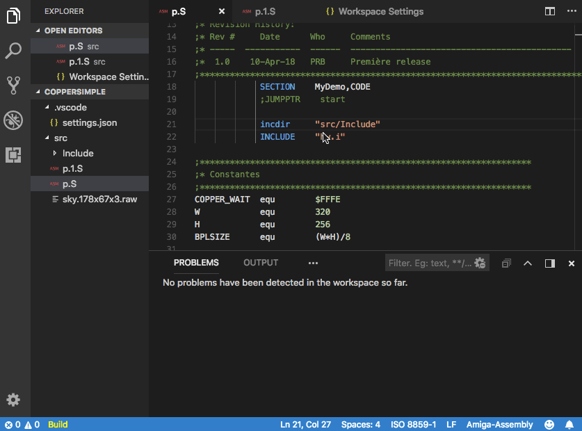
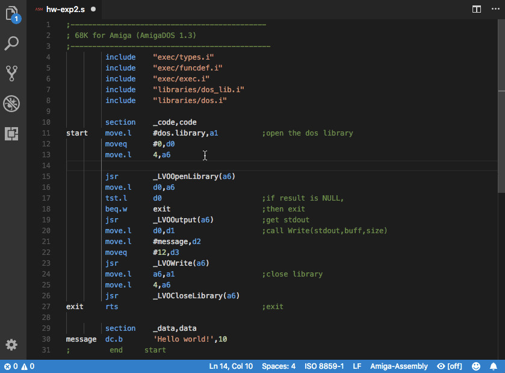
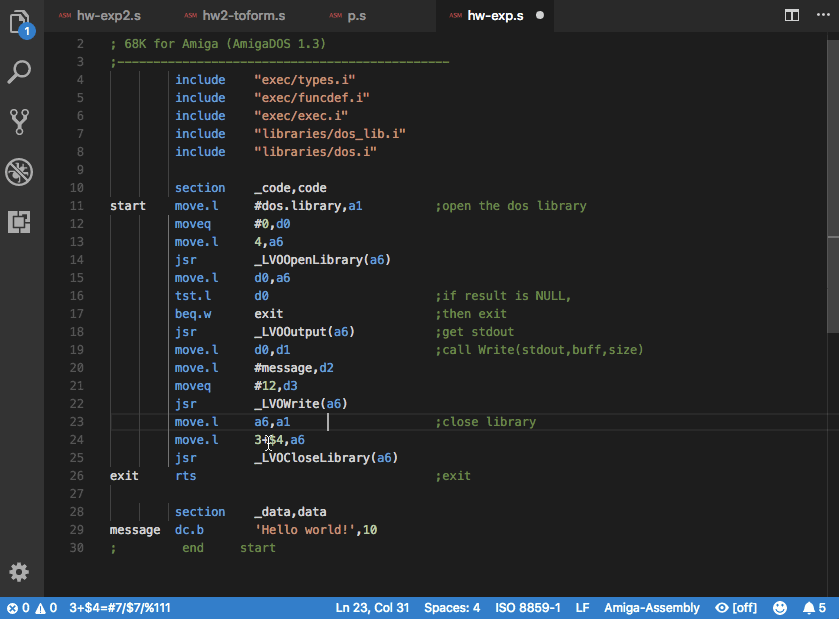
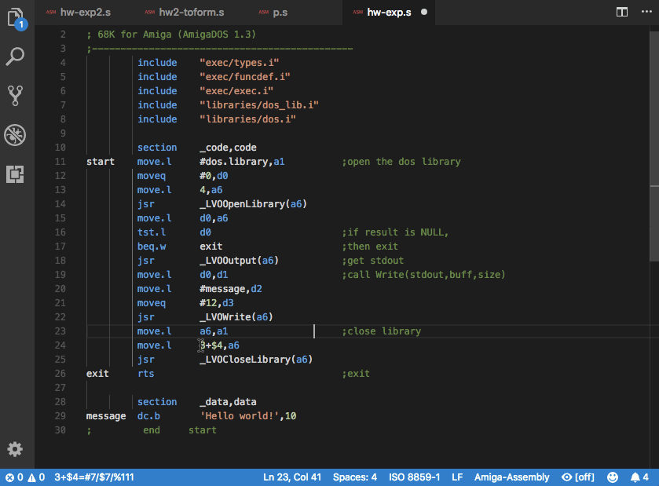
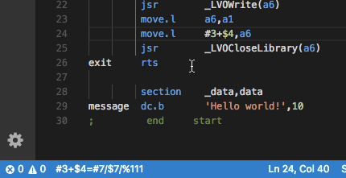

[](https://travis-ci.org/prb28/vscode-amiga-assembly) [](https://ci.appveyor.com/project/prb28/vscode-amiga-assembly)
[](https://coveralls.io/github/prb28/vscode-amiga-assembly?branch=)

# Amiga Assembly for Visual Studio Code
Amiga Assembly for Visual Studio Code is a extension to support assembly language for the Amiga Motorolla 68000 machines and emulators.

## New in 0.6.0
### VASM and VLINK integration
You can compile your program with [VASM](http://sun.hasenbraten.de/vasm/) and [VLINK](http://sun.hasenbraten.de/vlink/).

Setup:
- Download sources and compile VASM : http://sun.hasenbraten.de/vasm/index.php?view=compile
- Download sources and compile VLINK : http://sun.hasenbraten.de/vlink/index.php?view=compile
- Configure Amiga Assembly (don't forget to enable VASM and VLINK):
```
{
    "amiga-assembly.vasm": {
        "enabled": true,
        "file": "my/path/to/vasmm68k_mot",
        "options": [
            "-kick1hunks",
            "-devpac",
            "-Fhunk",
            "-w",
            "-chklabels"
        ]
    },
    "amiga-assembly.vlink": {
        "enabled": true,
        "file": "my/path/to/vlink",
        "includes": "**/*.{s,S,asm,ASM}",
        "excludes": "",
        "exefilename": "a.out",
        "options": [
            "-bamigahunk",
            "-Bstatic"
        ]
    }
}
```
- Relaunch Visual Studio Code

Now you can launch the build :
- Saving a file will produce a file in the build directory : 'build/myfile.o'.
- or Ctrl + Shift + P (or Command + Shift + P on Mac), and then search for Build Workspace: all the files will be built and the executable will be created.
- or click on the "Build" button on the satus bar to build the workspace.


### Compilation diagnostics
VASM will produce errors in the editor.
There is a output window to see the raw output from the compiler and linker.




## Features
### Motorola 68K Assembly Language Support
This feature is based on the work of Steve Saunders for Sublime Text m68k extension, it's available at https://github.com/stevenjs/M68k-Assembly. Some keywords have been added to be more accurate with the Amiga assembly.

### Document Formatting
#### Format a document
The assembly language will be formatted with the standard shortcuts :
- On Windows Shift + Alt + F
- On Mac Shift + Option + F
- On Ubuntu Ctrl + Shift + I
- or Ctrl + Shift + P (or Command + Shift + P on Mac), and then search for "Format Document".


#### Format a selection
- The format sizes are calculated only for the selection 


#### Format on typing
- Activate option formatOnType in the settings
```
{
    ...
    "editor.formatOnType": true,
    ...
}
```



#### Configure spacing between elements

|label|spacing|instruction|spacing|data|spacing|comment|
|-----|-----|-----|-----|-----|-----|-----|
|`mylabel`|**amiga-assembly.format.labelToInstructionDistance**|`move.l`|**amiga-assembly.format.instructionToDataDistance**|`d0,a0`|**amiga-assembly.format.dataToCommentsDistance**|`; mycomment`|

### Contextual documentation 
- On passing over an assembly command a short documentation will apear.
- On passing over a register address or name a short documentation will apear.


### Presentation of the value set to a register


### Shows a number in decimal / hexadecimal and binary


### Calculator
- Simple calculator command


- Selecting text to calculate



- Replacing the text by the result



- Evaluation in realtime in the status bar



### Color editor
- Visualisation of the color set to a register and visual edition


## Release Notes
### 0.6.1
- Bug fixes (see changelog)

### 0.6.0
- Integration of VASM : build and diagnostics in the editor
- Integration of VLINK : linking the executable
- Updated m68k instruction set documentation (contribution from [Stephen Moody](https://github.com/SteveMoody73))
- Bug fixes (see changelog)

### 0.5.0
- Color provider
- Added documentation for CIAA and CIAB
- Shows the values set to the registers
- Show values in decimal / hexadecimal and binary
- Calculator

### 0.4.0
- Format selection of document
- Format on typing
- Configurable default spacings

### 0.3.0
- Short documentation as hover over the commands and registers

### 0.2.0
- Initial release of Amiga Assembly
- Editor Highlights
- Document Formatting

## Misc credits
### Contributors
- [Stephen Moody](https://github.com/SteveMoody73)
### Open source projects
- MathCalc from [Pavel Ivashkov](https://github.com/paiv): a parser for basic mathematical expressions From here: https://paiv.github.io/blog/2016/03/23/js-calc.html
- [VASM](http://sun.hasenbraten.de/vasm/index.php?view=main) and [VLINK](http://sun.hasenbraten.de/vlink/index.php?view=main) from Volker Barthelmann and Frank Wille : compilation and linking for amiga m68k
### Documentation sources
- Amiga development: http://amiga-dev.wikidot.com/information:hardware
- M68k instruction set: http://users.encs.concordia.ca/~aagarwal/coen311/motorola68000.txt
### Extensions used for development
- TextMate Languages from Ben Hockley: https://marketplace.visualstudio.com/items?itemName=Togusa09.tmlanguage
- Spell Right from Bartosz Antosik: https://marketplace.visualstudio.com/items?itemName=ban.spellright
- TSLint from egamma: https://marketplace.visualstudio.com/items?itemName=eg2.tslint
### Dependencies for tests
- TypeScript: https://www.typescriptlang.org/
- node: https://nodejs.org/en/
- tslint: https://palantir.github.io/tslint/
- chai: http://www.chaijs.com/
- mocha: https://mochajs.org/
### Screen capture
- licecap: https://www.cockos.com/licecap/
### Alternatives
- m68k vscode plugin from Steven Tattersall: https://marketplace.visualstudio.com/items?itemName=steventattersall.m68k
- Calculator plugin from Lixquid: https://marketplace.visualstudio.com/items?itemName=lixquid.calculator